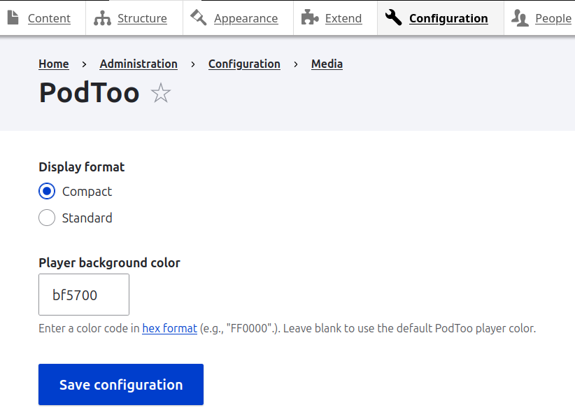
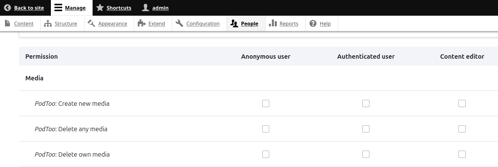
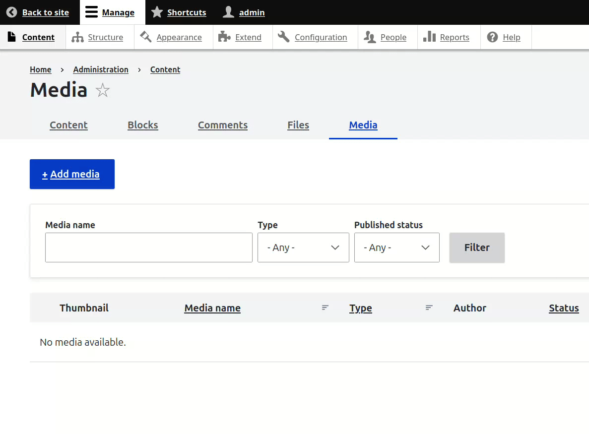

# Media Entity PodToo

This module provides a Drupal media entity type for easily embedding content from the streaming service PodToo. As with other Drupal media entity types, this can be made available to content editors through the Media Library, either through HTML editing in the CKEditor Media Library plugin, or as a dedicated media field on an entity type.

## Requirements

This module has the following requirements:

- Drupal ^9.2.9 || ^10
- Media (included in core)

## Installation

Add this module to a site's codebase as you would other custom modules. For most sites, that means locating these files in the `web/modules/custom` directory. At this time. this project is not available for inclusion through https://packagist.org.

Install as you would normally install a Drupal module, either through the "Extend" page in the Drupal interface or via command line (`drush en media_entity_podtoo -y`).

## Site-wide display settings

Set the display size and player color at **Configuration > PodToo** (`/admin/config/media/podtoo`). Only users/roles with the "Administer site configuration" permission may access these settings. Settings apply globally to all PodToo media instances.

## Permissions

Access to create, edit, and delete PodToo content is controlled through the standard list of Drupal permissions for media types. Go to **People > Permissions** (`/admin/people/permissions`) to assign the various PodToo content editorial permissions to roles appropriate for the given site. Grant the "Administer site configuration" permission to roles that should be able to set the site-wide configuration (see above.)

## Creating content

As with other Drupal media entities, new PodToo content can be added at **Content > Media > Add media > PodToo** (`/admin/content/media`) or from rich text editors that have been configured to use the Media Library plugin (`/admin/config/content/formats`), or directly through content types that have a media field that has been configured to allow PodToo content.

The following URL schemes are supported:

- `https://embed.podtoo.com/*`
- `https://podcasts.podtoo.com/*`

